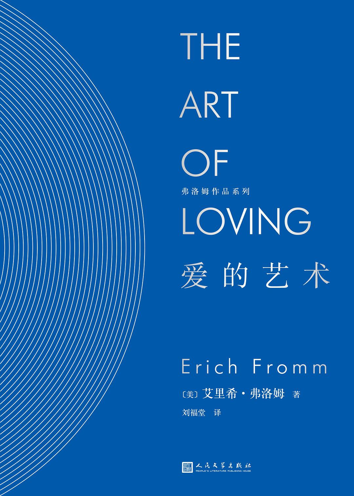

# 爱的艺术

## 一、爱是一种艺术吗？

​	爱是一门艺术吗？回答是肯定的。因此，它需要知识和努力。然而几乎很少有人认为：爱，还有需要学习的东西。

​	也有人认为，爱是一种快感，体验它是件随机而遇的事，一个人运气好便会“堕入”其中。这种特殊的态度建立在这样几个前提下：

1. 多数人宁愿把爱当成被爱的问题，而不愿当成爱的问题，即不愿当成一个爱的能力问题。对他们来说，爱就是如何被爱、如何惹人爱。事实上，我们这个社会大多数人所理解的“值得被人爱”无非是赢得人心和对异性有吸引力这两种倾向的混合物而已。`归根结蒂爱情的产生往往是以权衡对方及本人的交换价值为前提。`
2. 把爱的问题设想为一个对象的问题，而不是才能的问题。人们认为爱是简单的，困难的是寻找正确的爱的对象，或者被爱。
3. 在于把最初坠入情网的经历与爱的“久恒”（或用我们能够使用的较好的语言说：爱的“永恒”）之间的区别混淆了。

​	在学习任何一种艺术时，必要的步骤是什么呢？

​	学习任何一种艺术的过程都能够适当地分为两个方面：一方面精通那门艺术的理论，另一方面熟悉那门艺术的实践。

## 二、爱的理论

### 一、 爱，对人类生存问题的回答

#### 人的理论和生存理论——孤独

​	任何爱的理论，都必须从某种人的理论和人类的生存理论开始。

​	人拥有理智；人是生命，一种意识到自我存在的生命。人意识到自己，他人，人的过去和发展前途的可能性。人对他的单一存在的觉悟，对他短暂生命的觉悟，人意识到生不由己，死的必然，人知道自己的孤独和与世隔绝，意识到面对社会和自然的威力自己的无能为力——所有这一切都使他的特殊和孤寂的存在成为无法忍受的监禁。

​	经历过孤寂的人必然会有恐惧感。实际上孤寂感是每种恐惧的根源。孤寂意味着与外界没有联系，不能发挥人的力量，意味着一筹莫展，不能把握世界，事物和人；意味着世界把我淹没，而我只能听之任之。所以孤寂是引起强烈恐惧感的根源，同时孤寂还会引起羞愧和负罪的感觉。人——所有时代和生活在不同文化之中的人——永远面临同一个问题，即：如何克服这种孤独感，如何超越个人的天地，实现人类的大同。

​	人类越脱离原始的纽带，就越疏远自然世界，就越要寻找摆脱孤独的途径。达到这一目的的一种途径是不同形式的纵欲。例如自我引起——或借助于毒品——的恍惚状态就是一种形式的纵欲。原始部落的许多仪式提供了这方面活生生的例子。首先这些方式都是强烈的，甚至会很激烈；其次它们需要整个人——包括身心都投入进去，第三就是需要不断重复——因为纵欲的效果只能持续很短的时间。但是，无论是过去的人，还是现代人，克服孤独感最常用的方法却与此截然相反。这一方法就是通过同一组人保持一致，通过同一组人的习惯、风格和看法保持一致来达到同其他人的结合。

#### 人的理论和生存理论——结合

​	爱的结合——是作为对生存问题成熟的回答而提及爱呢，还是可被称为共生性结合的爱的那些不成熟形式？

​	共生性结合类似母体与胎儿的关系，有其生物学形态。母体和胎儿是两者，然而又是一体。他们生活在一起（共生），互相需要。胎儿是母亲的一部分，从她身上吸收他所需要的一切；母亲好似胎儿的世界，她喂养他，保护他，但她的生命也因胎儿而增强。在这种心理的共生性结合中，虽然两者身躯各自独立，但在心理上存在着同样的依赖性。

​	共生性结合的被动形式是屈从，或用临床术语说是受虐狂。这种受虐狂用使自己成为另一个支配他、管教他、保护他的人的一部分和附庸，来摆脱难以忍受的孤独和分离感，那个人像是他的生命和氧气。

​	共生性结合的主动形式是支配，或用心理学术语来说，与受虐狂相对应的是虐待狂。这种虐待狂想通过使另一个人成为自己的重要部分来摆脱孤独和禁锢感，他通过控制崇拜他的另一个人来为自己壮威，抬高身价。

​	与共生性结合相反，成熟的爱是在保持自己的尊严和个性条件下的结合。爱是人的一种主动的能力，是一种突破使人与人分离的那些屏障的能力，一种把他和他人联合起来的能力。爱使人克服孤独和分离感，但爱承认人自身的价值，保持自身的尊严。在爱之中，存在着这样的矛盾状态：两个人成为一体而仍然保留着个人尊严和个性。

​	爱是一种活动，不是一种消极的情绪；它是“永恒的”，而不是“堕入情网”。用最通俗的方式可以把爱的积极性表述为：爱主要是“给予”，而不是“接受”。

​	在给予的因素之外，爱的主动特性明显地表现在这样的事实中，即所有形式的爱常常包含着共同的基本要素：关心、责任、尊重和了解。

### 二、父母与子女之间的爱

​	母亲便是温暖，母亲便是食物，母亲便是满意和安全的和谐状态。这种状态——用弗洛伊德的话来说——是一种自恋状态。外界存在——人和物——只有当他们适合或挫伤婴儿肉体的内在状态时才有实际意义。只有内在的东西才是真实的，而身体之外的物只有符合我的需要——决不是符合事物本身的性质或需要——才是真实的。

​	母爱，归纳成一个更一般的公式便是：我因我的样子被爱。或者也可以更为准确地说：我是我，所以被爱。这种被母亲所爱的感受是被动的。我不必为了被人爱而做任何事——母爱是无条件的。童稚的爱遵循这一原则：“我因被爱而爱。”成熟的爱遵循“我因爱而被爱”这一原则。不成熟的爱宣称：“我爱你，因为我需要你。”成熟的爱是：“我需要你，因为我爱你。”

​	与爱的能力的发展密切相关的是爱的对象的发展。他与母亲的关系在一定程度上失去了事关存亡的重要性，与父亲的关系却越来越重要。母爱与父爱间的本质区别。母爱就其本质而言是无条件的。父爱是有条件的爱。这种爱的原则是：“我爱你，因为你实现了我的愿望，因为你尽了职责，因为你像我。”母亲是我们出生的地方，她是自然、土地和海洋；父亲却不代表任何这样的自然来源。他在孩子出生的头几年里几乎与其没有联系。在这一早期阶段，他对孩子的重要性无法与母亲相比。然而，尽管父亲不代表自然世界，他却代表人类生存的另一支柱，代表思想的世界，人化自然的世界，法律和秩序的世界，原则的世界，游历和冒险的世界。父亲是教育孩子并指引他步入世界之路的人。

### 三、爱的对象

​	爱主要不是一种对某个特殊人的关系；它是一种态度，一种决定一个人对整个世界而不是对某个爱的“对象”的关系的性格倾向。

##### 兄弟(人类)的爱

​	兄弟的爱，是构成各种爱的最基本的爱。兄弟之爱中存在着人类联合、人类团结和人类一体化之感。兄弟之爱建立在我们所有人一体的这种感受上。兄弟的爱是相互间平等的爱。然而，对无助者的爱，对穷人和陌生人的爱，是兄弟之爱的开端。

##### 母爱

​	母爱是对孩子生存及其需要的无条件的肯定。对孩子生存的肯定有两方面：一是对保护孩子生存和成长来说绝对必要的关心和责任；另一方面比单纯的保护更进一步，是灌输给孩子爱生命的态度，使孩子感到活着是美好的，无论是男孩还是女孩，活在这个地球上就很美好。

​	母亲与孩子的关系就其本质而言是不平等的：一方事事需要帮助，另一方则给予帮助。正因为母爱这种利他的无私特性，所以被认为是最高层次的爱，是一切感情中最为神圣的。

​	母爱的本质就在于关心孩子的成长，而这便意味着想让孩子离开她。它与性爱的根本区别就在于此。在性爱中，原本分离的两个人融为一体。在母爱中，原来融为一体的两个人分离了。

##### 性爱

​	性爱是一种排他的意愿与承诺的行为。兄弟的爱是平等的人之间的爱，母爱是对无助者的爱。尽管有区别，但是这两种爱的对象并没有囿于一个人，这一点是共同的。性爱是对与另一异性的完全融合、结为一体的渴望。从其本性来说，它是排他的，不具有一般特性的爱。它也许是所有形式的爱之中最靠不住的。如果说性爱是爱，那么它需要一个前提，那就是我从自身的存在本质出发去爱——并且也在他或她的存在本质中感受另一个人的爱。

##### 自爱

​	人们对自己的生命、幸福、成长、自由的肯定来源于人们爱的能力，即来源于爱护、尊重、责任和了解。倘若一个人能够卓有成效地爱，他也会爱自己；倘若他仅能爱其他人，他便根本不会爱。正确的是：自私者不能爱他人，因而也不能爱他们自己。

## 三、当代西方社会的爱及其瓦解

​	如果说爱是一种成熟的、具有创造性特点的能力，那么，无论生活在哪种特定文化中的个人的爱的能力，都取决于此种文化对一般人的性格所产生的影响。任何客观地观察我们西方生活的人都不怀疑：爱——兄弟的爱、母爱、性爱——是一种相对罕见的现象，而且，它的地位被各种伪装的爱取代。这些伪装的爱，实际上是爱的瓦解的诸多形式。

## 四、爱的实践

​	任何艺术的实践都有某些一般要求。

​	首先，艺术的实践要求有规范。如何实现规范呢？有规律地起床，按规律的时间思考、阅读、听音乐、散步之类的活动；不沉溺于逃避现实的活动，如看神奇的故事和电影，至少不超过一定限度；不过量饮食，这些都是显而易见的基本准则。但是，不应该像外界强加于自身的准则那样勉强实行，而应使它成为自身意愿的一种表达。它应使人感到快乐，以至慢慢地使人们与之相适应，成为人们一停止就会惦记的行为，这是必不可少的。

​	专心是掌握一门艺术的必要条件之一，这是无须证明的。

​	专心意味着孤独——而这种能力恰是具有爱的能力的一个条件。如果你能集中精力，至于做的是什么事则是无关紧要的。重要的与非重要的事物都能呈现新的真实，因为你对它们全神贯注。任何事只要专心做了，就会令人更加振作（虽然过后疲倦也会袭来，但那是自然的，有益于身体的），而一切没有专心做的事却使人困倦，但同时又使人夜里难以入眠。

​	任何曾试图精通一门艺术的人都知道，成就任何事都需要有耐心。

​	最后，对那门艺术予以最大关注是精通该艺术的一个条件。

​	爱的成功的主要条件乃是克服自恋。这种自恋表现为这样一种倾向性：人们感到真实的东西仅仅存在于自身的体验之中，外部世界的现象毫无真实性，而且总是从对人们有利或有害的观点上被感知。自恋的对立面是客观，那是一种按其本来面目认识人和事物并能够把客观现象与由于人的主观愿望和畏惧心理而形成的形象区分开来的本领。客观的思考本领是理智，理智后面的情感态度是谦卑。爱的能力取决于人们从自恋中解脱出来的能力，取决于从母系和氏族的稳固的眷恋中解脱出来的能力，取决于我们在与世界和自身的关系中生长和发展一种创造性倾向的能力。这种解脱过程、产生过程和觉醒过程，要求有一种品质为必要条件：信仰。

​	 需要区分理性的和非理性的信仰。所谓非理性的信仰对一个人或一种观念，我认为是建立在屈从于非理性的权威的基础上。相反，正确的信仰是根植于一个人思想和感情体验之中的信仰。理性的信仰并非主要是对某事的信奉，而是我们的信念具有的必胜和坚定的特质。信仰是人的全部人格中的性格特性，而不是一种特殊的信念。

​	要有信仰就需要勇气和冒险的能力，甚至准备迎接厄运和挫折。谁若坚持把安全和保险视为生活的基本条件，那他就不可能有信仰；谁若把自己封闭在自己的系统中——在这里疏远和占有是他的保险工具——便会把自己变为囚犯。被爱和爱都需要勇气，需要判明作为最终关系的一定价值的勇气，并需要采取果断措施，为这些价值牺牲一切的勇气。

